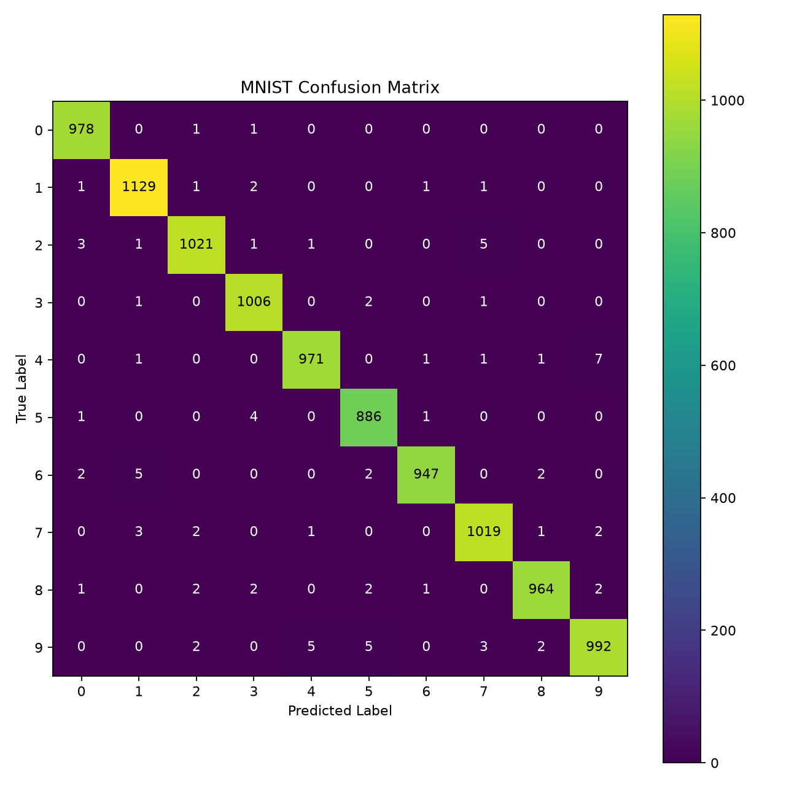
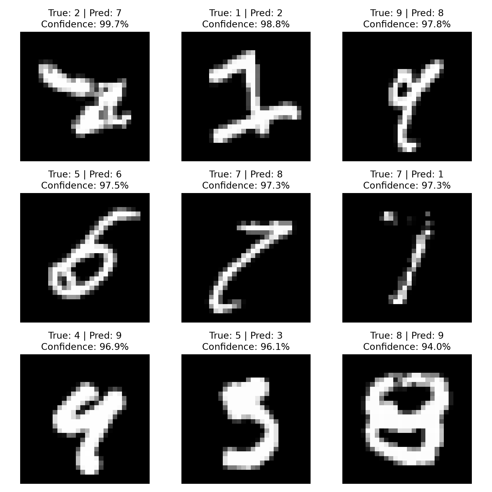

# MNIST CNN

用两组 Conv2d → ReLU → MaxPool2d 和一个 Linear 完成 0–9 分类。输入 [N,1,28,28]，中间 [N,16,14,14] → [N,32,7,7]，展平为 [N,1568]，输出 [N,10] logits。共 20,490 个可训练参数。

## 先读哪段代码

见 [阅读指南](../docs/reading_guide.md)。训练和验证循环保留原来的展开写法；保存的仍是纯 state_dict，可继续使用原有权重。

## 数据与评估约定

- MNIST 官方训练集 60,000 张，按同一个固定索引排列拆为 50,000 训练、10,000 验证；两者索引互不重叠。
- 训练与验证分别创建 Dataset，共用原始缓存但使用不同 transform。增强只作用于训练图片：RandomRotation(10) + RandomAffine(translate=(0.1,0.1))。
- 验证与官方测试集只做 ToTensor，不随机增强，不额外归一化，与旧权重一致。
- Early Stopping 用验证 loss，patience=3；保存最佳轮次的权重，训练代码不读取测试集。
- 默认 seed=42，固定模型初始化、随机划分、shuffle 和增强。复现以同一软件和硬件环境为前提，跨平台结果可能不同，参见 [PyTorch 复现说明](https://docs.pytorch.org/docs/stable/notes/randomness.html)。
- 不对数字做翻转或大角度旋转；当前轻微变换是一种合理起点，仍需通过验证与自己的图片检查实际效果。

数据缓存在仓库根目录 data/。get_dataset() 被调用时才加载/下载，导入文件不会自动下载。原来 mnist/data/.gitkeep 作为历史占位保留。

## 对照训练

在仓库根目录、激活环境后运行：

```powershell
python mnist/train.py --no-augmentation --seed 42 --output mnist/models/baseline_seed42.pth
python mnist/train.py --seed 42 --output mnist/models/augmented_seed42.pth
```

两次训练共用结构、划分、初始化种子、batch_size=64、Adam(lr=0.001)、最多 20 epochs 和 patience=3。由于增强消耗随机数，两组的数据变换过程不同；模型初始化和 shuffle 使用固定种子。

生成同名 .pth（权重）、.csv（每轮训练/验证指标）和 .json（参数记录）。现有文件不会被覆盖；另起文件名即可重跑。可用 --epochs 1 做流程检查，其结果不作为正式成绩。

## 测试与错误分析

完成模型与参数选择后运行：

```powershell
python mnist/test.py --model mnist/models/augmented_seed42.pth
python mnist/test.py --model mnist/models/augmented_seed42.pth --no-plot --save-dir mnist/results/augmented_seed42
```

输出 accuracy、loss、各类 precision/recall/F1 和 10×10 混淆矩阵。收集全部错图后按 Softmax 置信度降序排列，展示最高的 9 张。no-plot 不弹窗口；同时指定 save-dir 会保存图像。

save-dir 中的 metrics.json 包含权重 SHA-256，predictions.csv 包含每张图片的原始测试集索引、标签、预测、置信度；混淆矩阵行是真实类别、列是预测类别。Softmax 值不保证等于实际答对的概率。

## 已核验的历史结果

2026-10-02 用整理后的脚本重新评估，旧权重文件未修改：

| 权重 | 测试正确数 | 准确率 | 错误数 |
| --- | ---: | ---: | ---: |
| best_model.pth | 9,890 / 10,000 | 98.90% | 110 |
| best_model_augmented.pth | 9,913 / 10,000 | 99.13% | 87 |

[原模型指标](../docs/results/legacy_baseline/metrics.json) · [增强版指标](../docs/results/augmented/metrics.json)

两份历史权重的训练配置记录不完整，这是初步比较。此前记录中的 best_model01.pth 为 98.76%，这次没有重新测试该文件。上述两份模型的差值为 0.23 个百分点；后续应固定实验协议并重复多组配对种子，再报告均值和标准差。测试集用于结果汇报，模型选择依赖验证集。





增强版的 4→9 有 7 张，9→5 有 5 张；部分写法相近，需结合样本观察，不能只凭矩阵推断原因。

## 自己的手写图片预测

```powershell
python mnist/predict.py --model mnist/models/best_model_augmented.pth --image mnist/images/test.png
python mnist/predict.py --image path/to/white_background.png --invert
```

输入建议为单个居中数字，黑底白字、四周有空白；白底黑字添加 --invert。脚本沿用灰度化 → resize 28×28 → ToTensor → 增加 batch 维度，输出 logits 和 Top-3 概率。目前没有自动裁边和居中；任意手机照片与 MNIST 存在分布差异，这是后续误差分析的一部分。

## 可视化

```powershell
python mnist/show_augmentation.py --index 0
python mnist/visualize_features.py --model mnist/models/best_model_augmented.pth --index 0
python mnist/visualize_kernels.py --model mnist/models/best_model_augmented.pth
```

特征图脚本仍手动经过 Conv、ReLU、Pool 并打印每一步形状，方便学习。需要保存时，show_augmentation 和 visualize_features 使用 --save-dir，visualize_kernels 使用 --save 文件名；--no-show 可关闭窗口。

每张特征图或卷积核仍使用绘图工具单独缩放颜色，适合观察形状；不同通道的亮度不能直接用于比较绝对数值。

## 文件职责

| 文件 | 职责 |
| --- | --- |
| load_data.py | 路径、训练/评估 transform、按需创建 Dataset |
| network.py | CNN 结构与前向传播 |
| train.py | 数据划分、训练、验证、早停、权重和日志 |
| test.py | 测试、分类指标、混淆矩阵、错图与结果保存 |
| predict.py | 单张图片预处理与推理 |
| show_augmentation.py | 同一原图的随机增强展示 |
| visualize_features.py | 逐步计算并显示两层 ReLU 后的特征图 |
| visualize_kernels.py | 显示第一层 16 个 3×3 卷积核 |
